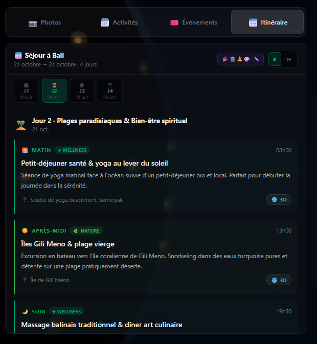
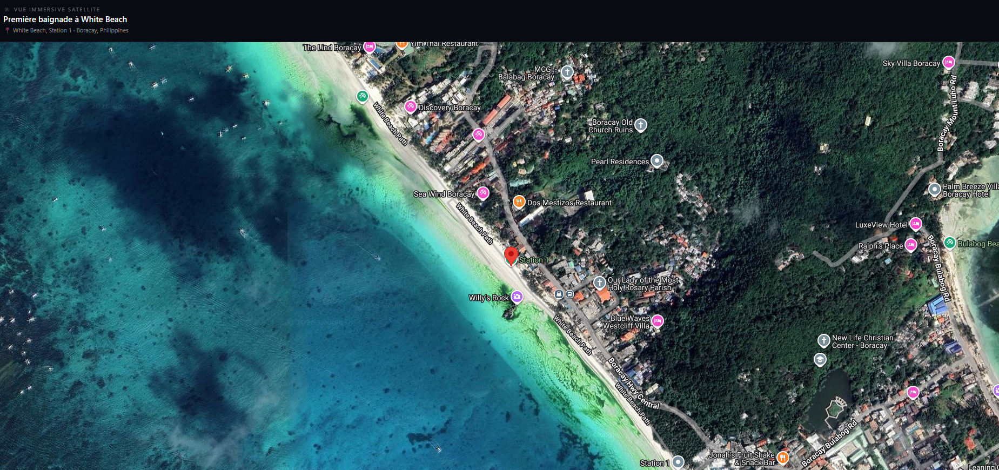
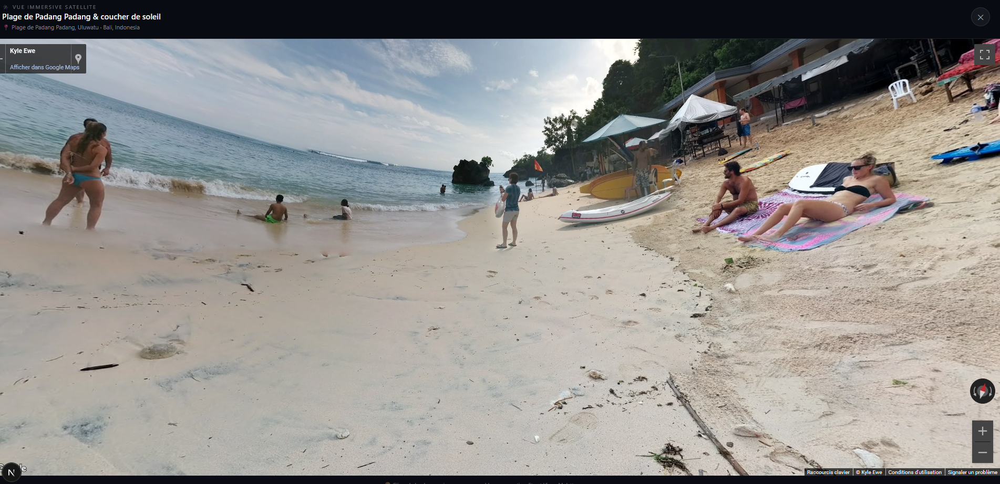

# GlobMotion

Interactive 3D globe that recommends travel destinations based on your mood and vibe. Pick how you feel, get AI-powered suggestions, then explore activities, local events, flight options and a generated itinerary for each destination.

> **Work in progress.** This is a personal side project that I keep improving in my spare time. It is functional, but not finished: see [Known limitations and roadmap](#known-limitations-and-roadmap).
>
> Live demo: _coming soon_

## Screenshots

| Day-by-day itinerary with 3D map links | Immersive satellite view |
|---|---|
|  |  |



## Features

- Interactive 3D globe with country markers and continent filters
- Mood/vibe-based destination recommendations (Claude API)
- Destination deep dive, activity suggestions and day-by-day itinerary planner
- Events aggregated from multiple sources (Ticketmaster, Eventbrite, SeatGeek, Bandsintown, Resident Advisor)
- Flight price comparison and deep links (Skyscanner, Google Flights, Kiwi, Kayak)
- Photo and video gallery (Unsplash, Pexels) and Google Maps 3D view
- Favorites saved across the session

## Tech stack

Next.js 16 (App Router) · React · TypeScript · Tailwind CSS · Three.js / three-globe · Anthropic SDK

## Architecture highlights

- `app/api/*`: server-side route handlers that keep API keys off the client
- `app/lib/adapters/`: one adapter per event provider behind a common `EventSourceAdapter` interface, wired through a registry and a regional router. Adding a source means adding one file; sources without a key are skipped automatically
- `app/components/Globe/`: the 3D scene, markers and `useGlobe` hook
- `data/`: static country, continent and mock destination data

## Getting started

```bash
npm install
cp .env.example .env.local   # then fill in your keys
npm run dev
```

Open http://localhost:3000. Only `ANTHROPIC_API_KEY` is required for the core experience; the other keys enable optional features.

## Scripts

| Command | Description |
|---|---|
| `npm run dev` | Start the dev server (webpack) |
| `npm run build` | Production build |
| `npm start` | Serve the production build |
| `npm run lint` | Run ESLint |

## Known limitations and roadmap

I am a junior developer and I want to be upfront about what is still missing:

- [ ] **Tests**: no automated tests yet. Planned: Vitest on `app/lib` (stream parsing, cache, event deduplication)
- [ ] **AI response validation**: model output is parsed as JSON without schema validation. Planned: Zod schemas
- [ ] **Rate limiting** on the AI routes to protect API quotas
- [ ] **Persistent server cache** (the current one is in-memory, per server instance), for example Redis
- [ ] **Project structure**: move components, hooks and lib out of `app/` (e.g. into `src/`) and group `lib` by feature
- [ ] **Refactor `page.tsx`**: split the main page into smaller hooks and components
- [ ] **Streaming** for the deep-dive and activities routes
- [ ] **Flight provider logos** (`/icons/*.svg`) are referenced but not yet added
- [ ] **Live demo** deployment

Some event sources (Resident Advisor, Songkick) rely on unofficial or restricted APIs and may stop working. The Google Maps 3D view requires a Google Cloud project with billing enabled.