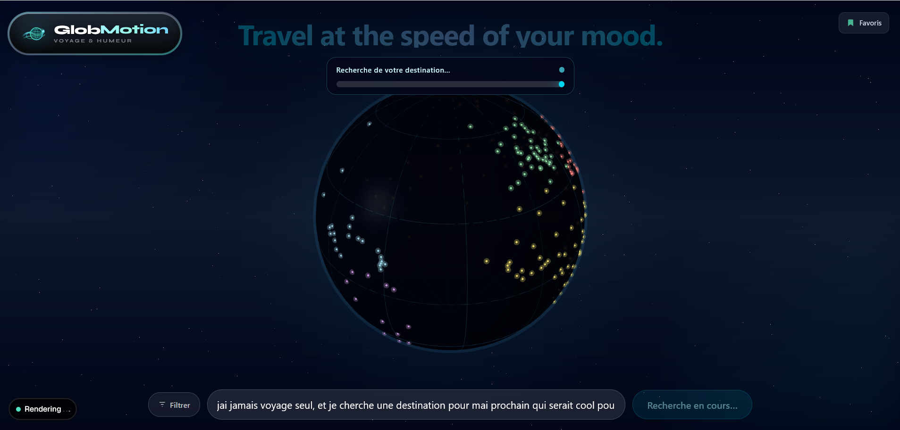
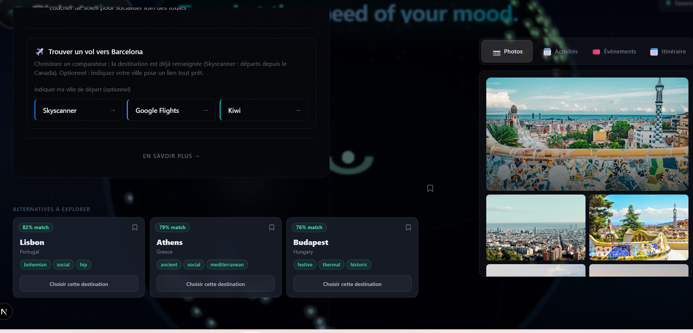
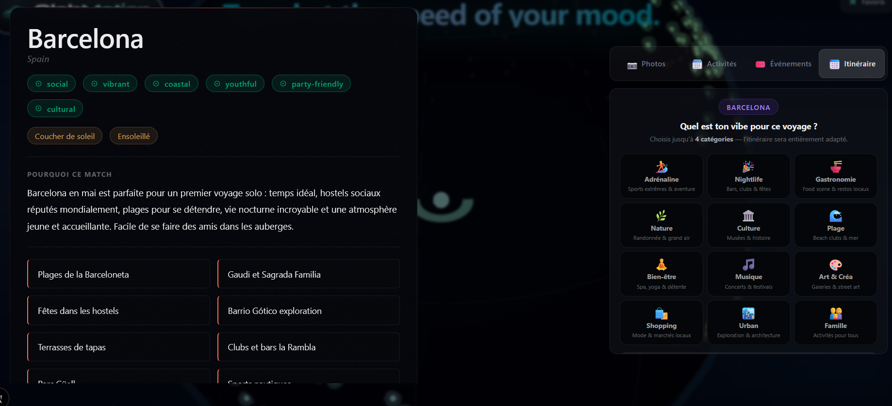
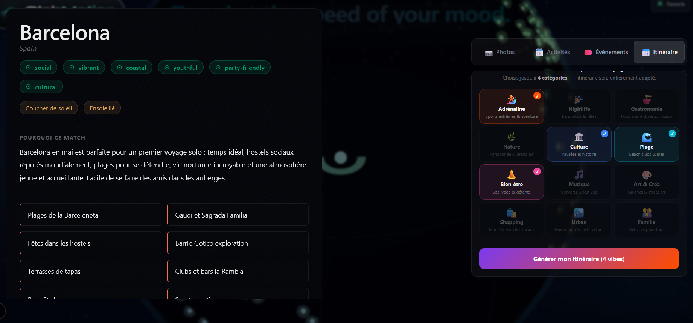
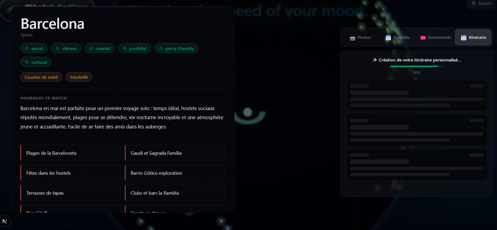
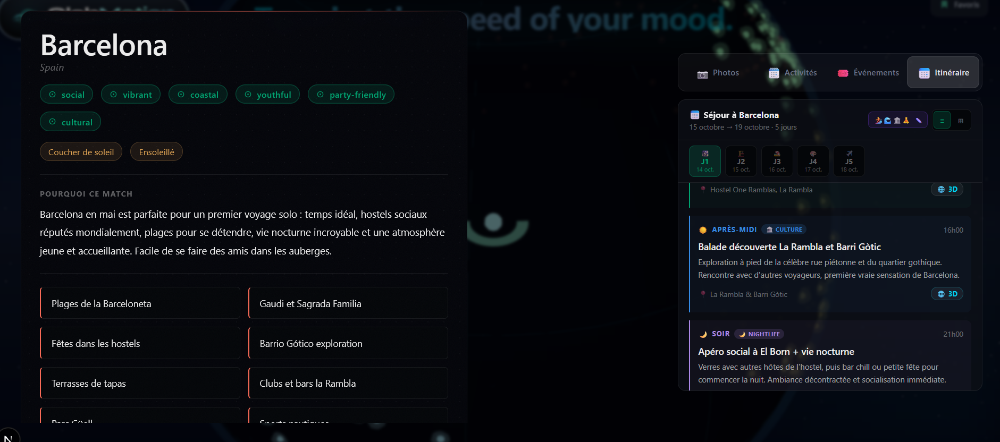
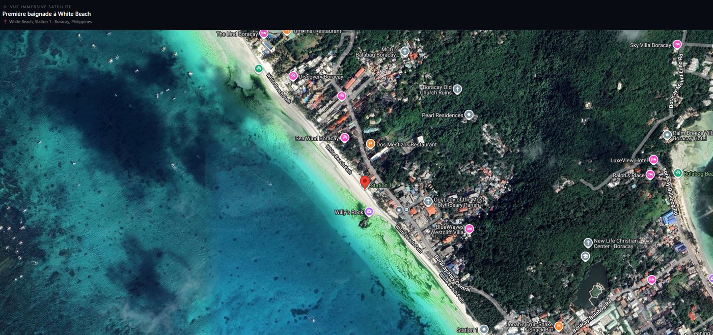

# GlobMotion

**Travel at the speed of your mood.** Tell GlobMotion how you feel in plain language ("I've never travelled solo and want somewhere social and sunny in May") and a 3D globe flies to your destination, then gives you everything you need to plan the trip: photos, activities, live events, flights and a personalised day-by-day itinerary.

> **Work in progress.** This is a personal side project that I keep improving in my spare time. It is functional, but not finished: see [Known limitations and roadmap](#known-limitations-and-roadmap).
>
> Live demo: _coming soon_



## Why it is more than a chatbot

- **The answer is an experience, not a wall of text.** The globe starts zooming on the destination while the AI response is still streaming in, and the main card opens before the alternatives are even generated.
- **Real data around the AI.** Events come from several providers (deduplicated, mood-scored, with per-source timeouts), flights link straight to comparison engines, photos come from Unsplash and Pexels.
- **Every itinerary activity is explorable.** Each one carries a **3D** badge that opens an immersive satellite or Street View of the exact place.

## Take the tour

### 1. Get a match, alternatives and a way to get there

A main destination with the reasons it fits you, three alternatives with a match score, a photo gallery, and one-click flight comparison pre-filled with your destination.



### 2. Build an itinerary around your vibe

Pick up to four vibes (adrenaline, nightlife, food, culture, beach, wellness...) and choose your dates.

| Choose your vibes | Up to 4 categories |
|---|---|
|  |  |

The itinerary streams in with a progress indicator and skeleton cards, then appears day by day, split into morning, afternoon and evening, each tagged by category.

| Generating | Result |
|---|---|
|  |  |

### 3. Step into the place

Tap **3D** on any activity to jump into a satellite map or an immersive Street View of the spot.

| Satellite view | Street View |
|---|---|
|  |  |

## Features

- Interactive 3D globe with country markers and continent filters
- Natural-language search plus a guided filter panel
- Destination deep dive, activity suggestions and day-by-day itinerary planner
- Events aggregated from multiple sources (Ticketmaster, Eventbrite, SeatGeek, Bandsintown, Resident Advisor)
- Flight deep links (Skyscanner, Google Flights, Kiwi, Kayak) and price comparison
- Photo and video gallery (Unsplash, Pexels) and Google Maps 3D / Street View
- Favorites saved across the session
## Tech stack

Next.js 16 (App Router) · React · TypeScript · Tailwind CSS · Three.js / three-globe · Anthropic SDK

## Architecture highlights

- `app/api/*`: server-side route handlers that keep API keys off the client
- `app/lib/adapters/`: one adapter per event provider behind a common `EventSourceAdapter` interface, wired through a registry and a regional router. Adding a source means adding one file; sources without a key are skipped automatically
- `app/components/Globe/`: the 3D scene, markers and `useGlobe` hook
- `data/`: static country, continent and mock destination data

## Getting started

```bash
npm install
cp .env.example .env.local   # then fill in your keys
npm run dev
```

Open http://localhost:3000. Only `ANTHROPIC_API_KEY` is required for the core experience; the other keys enable optional features.

## Scripts

| Command | Description |
|---|---|
| `npm run dev` | Start the dev server (webpack) |
| `npm run build` | Production build |
| `npm start` | Serve the production build |
| `npm run lint` | Run ESLint |

## Known limitations and roadmap

I am a junior developer and I want to be upfront about what is still missing:

- [ ] **Tests**: no automated tests yet. Planned: Vitest on `app/lib` (stream parsing, cache, event deduplication)
- [ ] **AI response validation**: model output is parsed as JSON without schema validation. Planned: Zod schemas
- [ ] **Rate limiting** on the AI routes to protect API quotas
- [ ] **Persistent server cache** (the current one is in-memory, per server instance), for example Redis
- [ ] **Project structure**: move components, hooks and lib out of `app/` (e.g. into `src/`) and group `lib` by feature
- [ ] **Refactor `page.tsx`**: split the main page into smaller hooks and components
- [ ] **Streaming** for the deep-dive and activities routes
- [ ] **Flight provider logos** (`/icons/*.svg`) are referenced but not yet added
- [ ] **Live demo** deployment

Some event sources (Resident Advisor, Songkick) rely on unofficial or restricted APIs and may stop working. The Google Maps 3D view requires a Google Cloud project with billing enabled.
